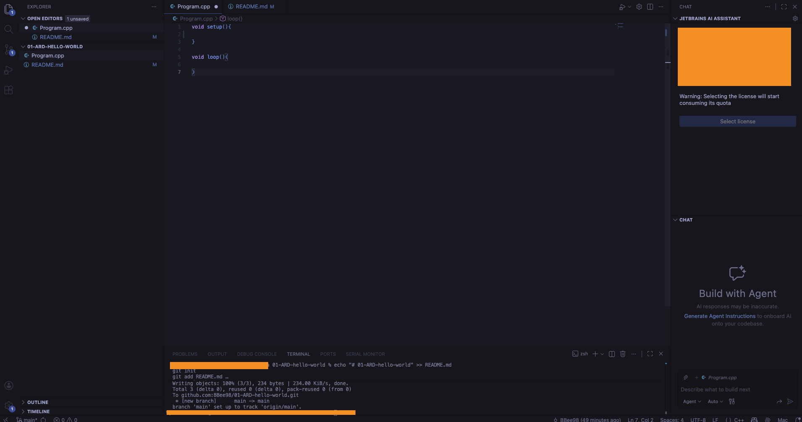
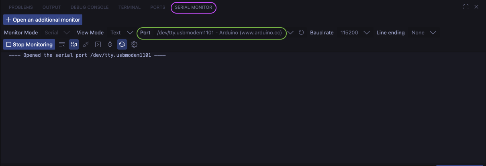

# <font color="#0f9f91"> 🤖 ARDUINO</font>

## Arquitectura básica de un proyecto de Arduino
   
### Parte de Software

Lo principal para poder desarrollar la parte de **software** de un proyecto de arduino es **tener un IDE**, también conocido como **editor de código**.

.

En esta herramienta, que es una especie de **word con superpoderes**, escribiremos el código que nos permitirá manipular nuestro arduino.

El **IDE** que vamos a utilizar es **<font color="#0f9f91">Arduino IDE</font>**, que es el oficial del propio arduino.

> 👉 URL de descarga aquí 🌏 https://www.arduino.cc/en/software/

### Parte de Hardware

[WIP]

### Ficheros del proyecto

Un proyecto de arduino tiene **un fichero principal** dentro de su estructura:

```
sketch/
└── sketch.ino/
```

- **sketch** es el **fichero raíz** de nuestro proyecto
- `sketch.ino` será el **fichero principal**, el que contendrá el código que dicatará las instrucciones a nuestro arduino.

## Cómo comunicar el IDE con arduino

.

## 🧏🏻‍♂️ 🧏🏾‍♀️ Señales digitales

Las señales digitales principales existentes en los dispositivos electrónicos son **INPUT** y **OUTPUT**

#### 🔌 INPUT

> 🌏 https://www.luisllamas.es/entradas-digitales-en-arduino/

Significa **entrada de información**. Los dispositivos que son de tipo **INPUT** significa que **envían** señales (o información) a **otro dispositivo**. Por ejemplo: un sensor de temperatura, un sensor de movimiento... Todos estos elementos **envían** una señal de acuerdo a **lo que captan**.

- El sensor de movimiento **emitirá** una señal cuando detecte que **algo o alguien** se esta moviendo.
  
- El sensor de temperatura **emitirá** una señal cuando detecte **cambios** en la temperatura.

#### 🖥️ OUTPUT

> 🌏 https://www.luisllamas.es/salidas-digitales-en-arduino/

Significa **salida de información**. Los dispositivos que son de tipo **OUTPUT** son los que **reciben** una señal y la **transforman** en un dato legible para los humanos. Por ejemplo: la pantalla de un ordenador, una bombilla de luz...

- La pantalla de un ordenador **transforma** la señal recibida en **datos visuales**; por ejemplo, en texto o en imágenes.

- La bombilla de luz **transforma** la señal recibida en **iluminación**. Si recibe señal, se ilumina; si no, se apaga.
  
En el pequeño proyecto de arduino en el que estamos trabajando, tenemos **un led de color rojo** que se **iluminará** cuando nuestro código le envíe una **señal**; por tanto, debemos registrar este pin como tipo **OUTPUT**:

````cpp
  pinMode(PIN_TO_ILUMINATE, OUTPUT);  
````                                                                                                          

#### E-bibliografía


- API de Arduino: https://docs.arduino.cc/learn/programming/reference/
- Esquema básico de un proyecto de arduino: https://docs.arduino.cc/arduino-cloud/guides/arduino-c/

# 01-ARD-basics
